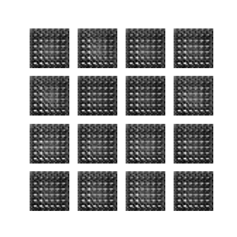
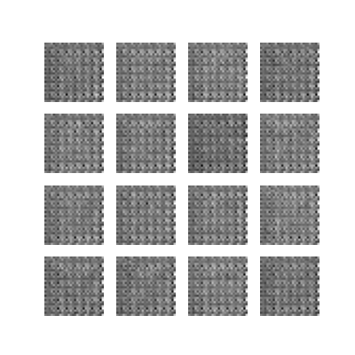
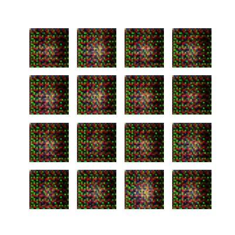
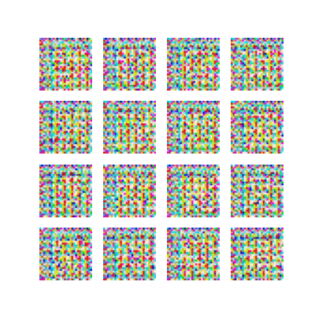

# GAN Face Generation

This is an experiment with face generation using a simple Generative Adversarial Network (GAN). 

## The dataset
https://www.kaggle.com/datasets/cashutosh/gender-classification-dataset

## Results
- "smaller filters" means the convolution layer filters were `(3,3)` 
- If no filter size is mentioned, the convolution layer filters were `(5,5)`

### Grayscale
- For grayscale training, I transformed the colored images in the dataset to grayscale.

&nbsp;

- Grayscale: 
- 

&nbsp;

- Grayscale with smaller filters:
-  

### Color
- Color: 
- 

&nbsp;

- Color with smaller filters:
- 